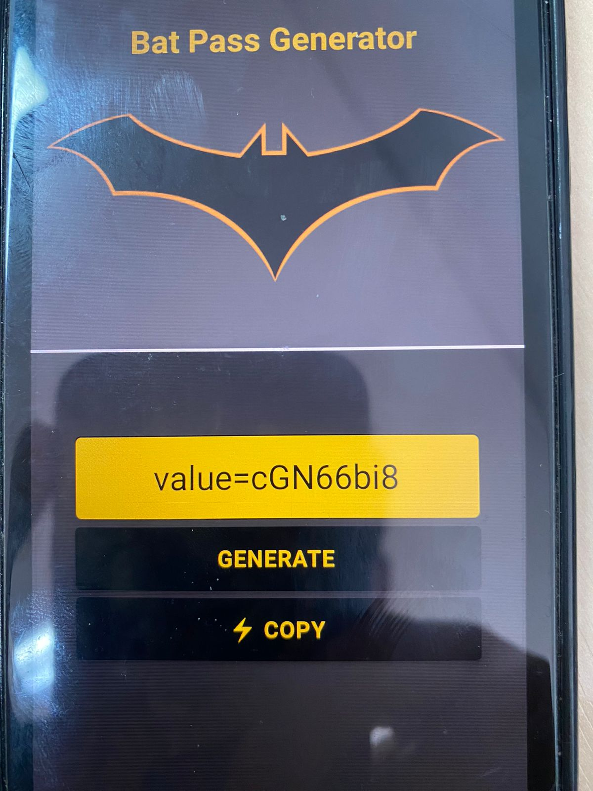
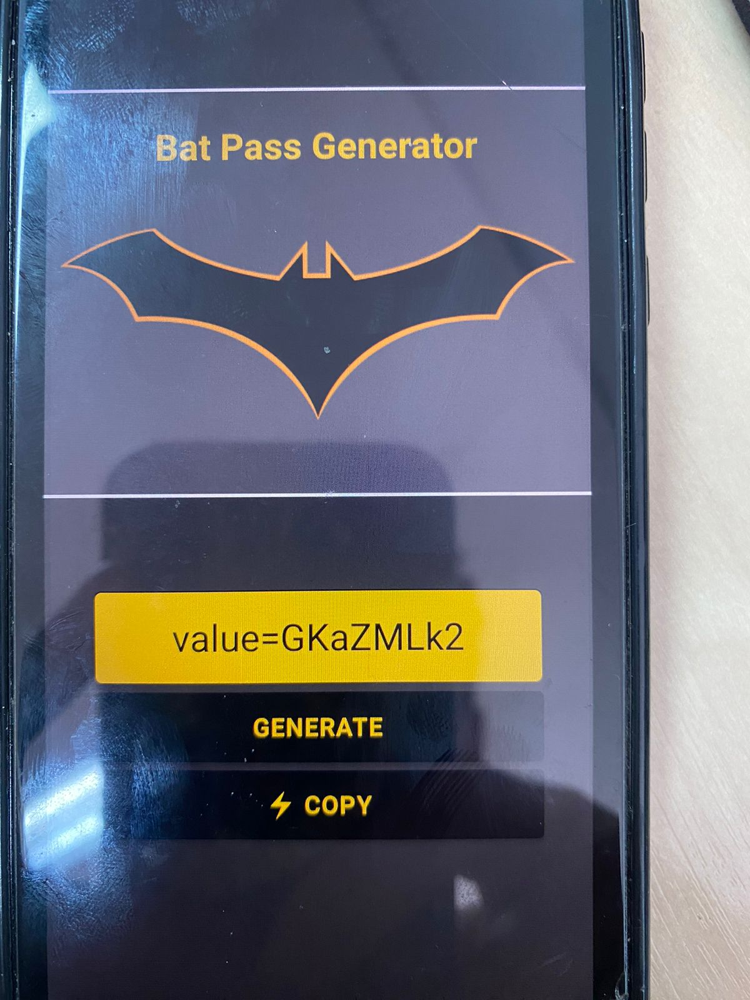
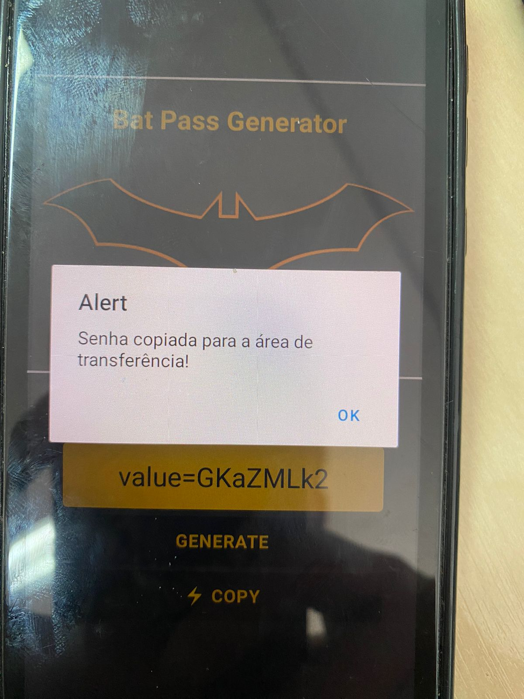

# 🦇 Bat Pass App

Gerador de senhas seguro e rápido com o tema do **Batman**, desenvolvido em **React Native** com **Expo**.  
Permite criar senhas aleatórias e copiá-las para a área de transferência com apenas um toque.


---

## 📱 Capturas de Tela

| Tela Inicial | Senha Gerada | Cópia de Senha |
|--------------|--------------|----------------|
|  |  |  |

---

## 🚀 Instalação e Execução

### 1️⃣ Clonar o repositório
```bash
git clone https://github.com/seu-usuario/project-sequenciador-de-senhas.git
cd project-sequenciador-de-senhas/bat-pass-app
```

### 2️⃣ Instalar dependências
```bash
npm install
# ou
yarn install
```

### 3️⃣ Executar no Expo
```bash
npx expo start
```
Abra no seu celular com o aplicativo **Expo Go** ou emulador.

---

## 📂 Estrutura do Projeto

```
src/
│
├── components/
│   ├── BatLogo/              # Logo e título do app
│   │   ├── BatLogo.tsx
│   │   └── BatLogoStyles.tsx
│   ├── BatButton/            # Botões de gerar e copiar senha
│   │   ├── batButton.tsx
│   │   └── batButtonStyles.tsx
│   └── BatTextInput/         # Campo para exibir senha gerada
│       ├── batTextInput.tsx
│       └── batTextInputStyles.tsx
│
├── pages/
│   ├── Home.tsx               # Tela inicial
│   └── Style.tsx              # Estilos globais da tela inicial
│
└── services/
    └── passwordService.ts     # Função de geração de senha
```

---

## 📌 Funcionalidades

✅ **Gerar Senha Aleatória**  
✅ **Exibir Senha no Campo de Texto**  
✅ **Copiar Senha para Área de Transferência**  
✅ **Interface Temática do Batman**  

---

## 🎨 Paleta de Cores

| Elemento           | Cor       |
|--------------------|-----------|
| Fundo Principal    | `#333333` |
| Área do Logo       | `#4D4D4D` |
| Texto/Títulos      | `#E5BF3C` |
| Botões             | Preto com texto amarelo |
| Campo de Entrada   | Amarelo com texto preto |

---


